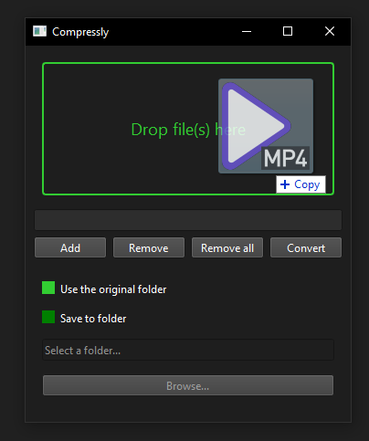

# Compressly
Compress your videos with a simple drag and drop.

# General
Compressly is a GUI app built with PySide6 (Qt python bindings) and uses FFmpeg to compresses your videos using SVT-AV1 codec to minimize the size of your videos.

# Licensing and Third-Party Software
This software uses several third-party libraries under different open-source licenses.

## FFmpeg
This software utilizes FFmpeg, a comprehensive multimedia processing library, under the LGPL version 3.0. A copy of the LGPL license is provided with this software distribution as [LGPLv3](external/ffmpeg/License_ffmpeg.md).

You can obtain the source code for FFmpeg from the official FFmpeg website at https://ffmpeg.org/download.html.

## SVT-AV1
This software also includes the SVT-AV1 library for AV1 video encoding, which is licensed under the BSD 3-Clause License. A copy of this license is provided with this software distribution as [BSD 3-Clause Clear](external/ffmpeg/License_SvtAv1.md).

The SVT-AV1 library is developed by the OpenVisualCloud project and is available under the BSD 3-Clause License. You can obtain the source code for the SVT-AV1 library from its official repository at https://github.com/OpenVisualCloud/SVT-AV1.

## PySide6
This software uses PySide6, which provides Python bindings for the Qt application framework and is licensed under the LGPL version 3. A copy of this license is provided with this software distribution as [LGPLv3](external/PySide6/License_PySide6.md).

You can obtain the source code for PySide6 from the official Qt for Python website at https://www.qt.io/qt-for-python.

# Acknowledgments
We acknowledge the contributions of the FFmpeg, OpenVisualCloud, and Qt for Python projects and their developers. These tools are essential parts of this software, and we are grateful for the efforts of these communities.
